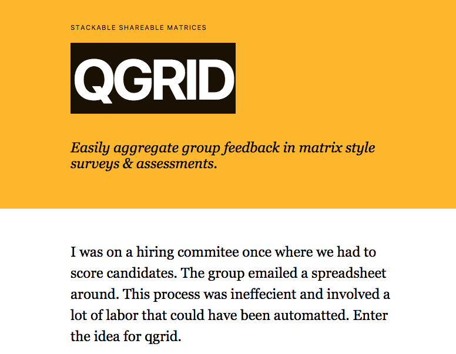

## qgrid
stackable shareable matrices
Easily aggregate group feedback in matrix style surveys & assessments.

## Getting started

 - Setup a virtual enviornment `python3 -venv env`
 - Source it `source env/bin/active`
 - Install requirements `pip3 install -r requirements.txt`
 - Create db.sqlite3 with tables `apistar create_tables`
 - Populate tables with dummy fixtures `apistar fixtures`
 - From `front/src` build the elm app `elm-make Main.elm --output=../static/js/main.js --warn --debug`
 - then from qgrid: `apistar run`

